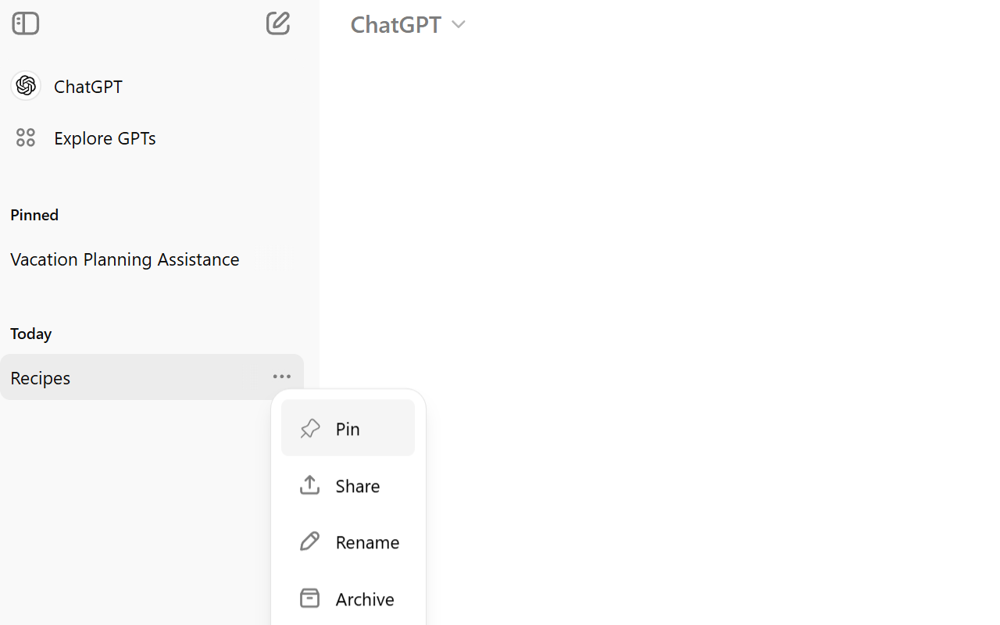
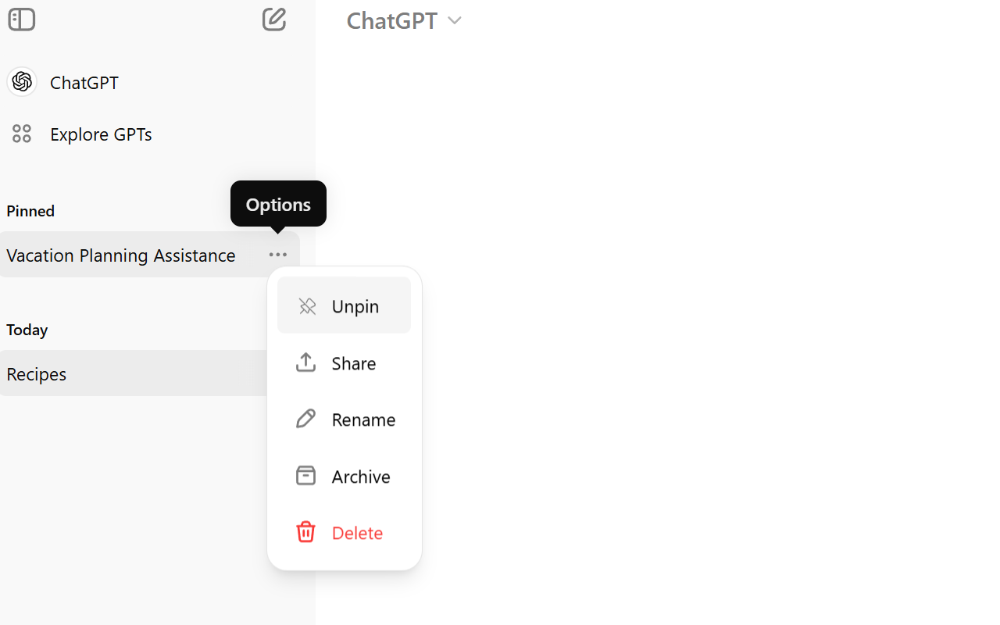

# ChatGPT++

## Overview
ChatGPT++ is a browser extension that enhances the ChatGPT interface with additional features such as pinning chat history items and providing a better overall user experience.

## Features
- Pin and unpin history items for easy access.
- Manage your pinned chats within a dedicated section on the sidebar.
- Simple and easy-to-use interface integrated with the ChatGPT site.

## Installation
To install the extension:
1. Download the latest extension from the [releases page](./releases).
2. Extract the downloaded zip file.
3. Load it as an unpacked extension in your browser:
   - **For Chrome/Edge**: Go to `chrome://extensions/` or `edge://extensions/`, enable developer mode, and load the unpacked extension from the extracted folder.
4. Enjoy enhanced features in ChatGPT!

## Usage
- After installing the extension, the pinned section will automatically be added to the ChatGPT interface.
- You can pin/unpin items by selecting the "Pin" or "Unpin" option from the menu associated with each chat history item.

### Pin Icon:

### Unpin Icon:

## Known Issues

- **Light Mode Only:**  
  ChatGPT++ currently only supports light mode and may not display correctly in dark mode.
  
- **Flickering:**  
  Pinned items may flicker when switching between chats.

- **Pin/Unpin Menu Availability:**  
  The Pin/Unpin menu item may not be available immediately after pinning or unpinning an item. To resolve this, click on another chat item and then return to the previously pinned or unpinned item.

- **Local Storage:**  
  Since pinned items are stored in local browser storage, they will not be accessible if you switch to a different machine, browser, or browser profile. Pinned items are tied to the specific instance of the browser where the extension is installed.

- **OpenAI Mobile Application Compatibility:**  
  This extension does not work with the OpenAI mobile application.

## Contributing
Feel free to submit issues or pull requests to contribute to the project!

## License
This project is licensed under the MIT License. See the [LICENSE](./LICENSE) file for details.
